# プラグイン
## 基本

### [remote-development](https://marketplace.visualstudio.com/items?itemName=ms-vscode-remote.vscode-remote-extensionpack)
リモートマシンやdockerなど様々な環境でvscodeを実行できるようになる。

### [Live Share](https://marketplace.visualstudio.com/items?itemName=MS-vsliveshare.vsliveshare)
共同編集が可能になる。webオンラインエディタでの共有ができ、
サーバのポート、ターミナルの共有も行える

### [ErrorLens](https://marketplace.visualstudio.com/items?itemName=usernamehw.errorlens)
エラーや警告が表示される

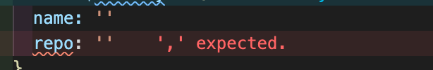

### [indent-rainbow](https://marketplace.visualstudio.com/items?itemName=oderwat.indent-rainbow)
インデントが虹色で表示される

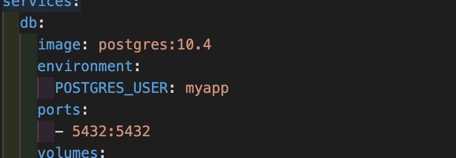

### [vscodeintellicode](https://marketplace.visualstudio.com/items?itemName=VisualStudioExptTeam.vscodeintellicode)
AI支援サジェスト(図中の星がついたもの)。初期状態ではサジェストはアルファベット順に表示されるが関連性の高いものが優先表示されるようになる

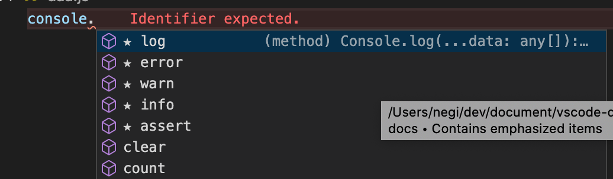

### [bracket-pair-colorizer-2](https://marketplace.visualstudio.com/items?itemName=CoenraadS.bracket-pair-colorizer-2)
括弧が色付けされ、ネストするごとに色が変わる

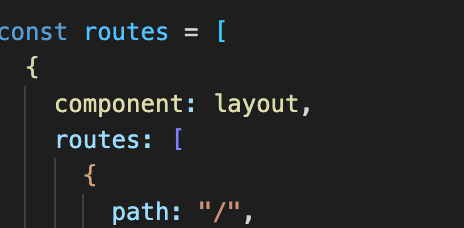

### [code-spell-checker](https://marketplace.visualstudio.com/items?itemName=streetsidesoftware.code-spell-checker)
スペルミスを指摘してくれる

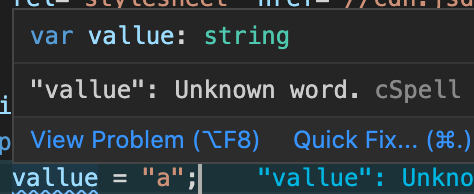

### [trailing-spaces](https://marketplace.visualstudio.com/items?itemName=shardulm94.trailing-spaces)
行末のスペースを表示する

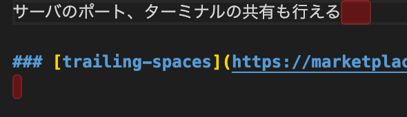

### [output-colorizer](https://marketplace.visualstudio.com/items?itemName=IBM.output-colorizer)
vscodeのログに色を付ける

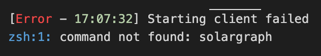

### [EditorConfig](https://marketplace.visualstudio.com/items?itemName=EditorConfig.EditorConfig)
エディタに問わず同様のプラグインがあるため、設定項目は少ないが、最低限の共通の設定ができる

### [TODO Tree](https://marketplace.visualstudio.com/items?itemName=Gruntfuggly.todo-tree)
`TODO`などを強調表示し、簡易に一覧できる

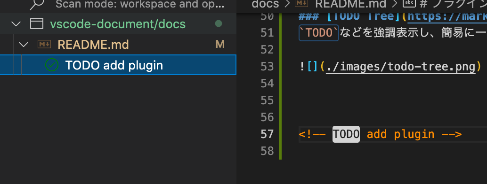

### [evilInspector](https://marketplace.visualstudio.com/items?itemName=saikou9901.evilinspector)
全角スペースを表示

### [rainbow-csv](https://marketplace.visualstudio.com/items?itemName=mechatroner.rainbow-csv)
CSVを列単位で虹色に表示してくれる

### [plantuml](https://marketplace.visualstudio.com/items?itemName=jebbs.plantuml)

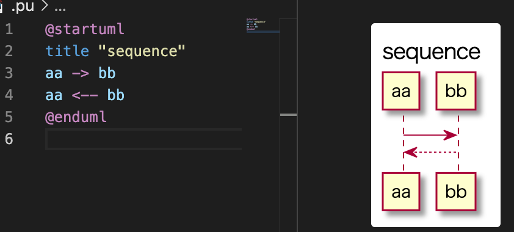

## docker

### [docker](https://marketplace.visualstudio.com/items?itemName=ms-azuretools.vscode-docker)
イメージやネットワーク、ボリュームなど一覧できる

### [docker-compose](https://marketplace.visualstudio.com/items?itemName=p1c2u.docker-compose)

## git

### [vscode-pull-request-github](https://marketplace.visualstudio.com/items?itemName=GitHub.vscode-pull-request-github)
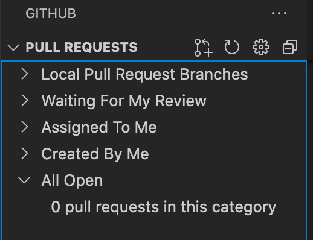

### [gitlink](https://marketplace.visualstudio.com/items?itemName=qezhu.gitlink)
選択箇所のgithubリンクを生成、開くことができる

### [git-project-manager](https://marketplace.visualstudio.com/items?itemName=felipecaputo.git-project-manager)
ローカルのgitプロジェクト単位で切り替えられるコマンドの追加

### [git-history](https://marketplace.visualstudio.com/items?itemName=donjayamanne.githistory)
gitの履歴表示に特化したプラグイン。画面上に常に表示されるものではないため、gitlensとの併用もあり。

### [GitLens](https://marketplace.visualstudio.com/items?itemName=eamodio.gitlens)
エディタ上でgitの操作が行え、
blameやファイル単位の履歴など見える

## web開発

### [auto-rename-tag](https://marketplace.visualstudio.com/items?itemName=formulahendry.auto-rename-tag)
タグの名前変更を片方を変更したら自動で変更される

<video controls>
  <source src="./images/auto-rename-tag.mov" type="video/mp4">
</video>

### [LiveServer](https://marketplace.visualstudio.com/items?itemName=ritwickdey.LiveServer)
簡易のwebローカルサーバーを立ち上げてくれる.自動リロードなどもしてくれ、ローカルファイル上では動かないプログラムの確認ができる

### [Open in browser](https://marketplace.visualstudio.com/items?itemName=techer.open-in-browser)
指定のファイルをブラウザで開く。

### [style-lint](https://marketplace.visualstudio.com/items?itemName=stylelint.vscode-stylelint)
cssのlintツール

#### [debugger-for-chrome](https://marketplace.visualstudio.com/items?itemName=msjsdiag.debugger-for-chrome)

#### [html-css-support](https://marketplace.visualstudio.com/items?itemName=ecmel.vscode-html-css)

#### [prettier](https://marketplace.visualstudio.com/items?itemName=esbenp.prettier-vscode)
コードフォーマッター

### javascript(nodeなども含む)
#### [npm](https://marketplace.visualstudio.com/items?itemName=eg2.vscode-npm-script)

#### [es-lint](https://marketplace.visualstudio.com/items?itemName=dbaeumer.vscode-eslint)

#### [node-debug2](https://marketplace.visualstudio.com/items?itemName=ms-vscode.node-debug2)

#### [npm-intellisense](https://marketplace.visualstudio.com/items?itemName=christian-kohler.npm-intellisense)

#### [search-node-modules](https://marketplace.visualstudio.com/items?itemName=jasonnutter.search-node-modules)
node_modulesから検索できる

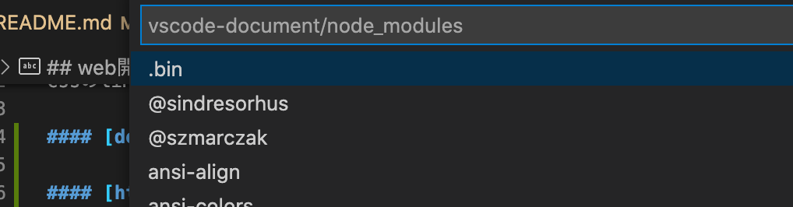

### [vscode-import-cost](https://marketplace.visualstudio.com/items?itemName=wix.vscode-import-cost)
モジュールのサイズを表示してくれる
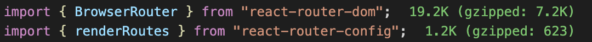

### [path Intellisense](https://marketplace.visualstudio.com/items?itemName=christian-kohler.path-intellisense)

#### テスト
##### [jest](https://marketplace.visualstudio.com/items?itemName=Orta.vscode-jest)

### ruby
#### [ruby](https://marketplace.visualstudio.com/items?itemName=rebornix.Ruby)

#### [ruby-rubocop](https://marketplace.visualstudio.com/items?itemName=misogi.ruby-rubocop)
エディタ上でrubocopを実行

#### [ruby-solargraph](https://marketplace.visualstudio.com/items?itemName=castwide.solargraph)
rubyのコード補完や関数ジャンプを可能にする

#### [Rails Run Specs](https://marketplace.visualstudio.com/items?itemName=noku.rails-run-spec-vscode)
エディタ状でrspecを実行できる。エディタ状にテスト結果なども表示され便利
